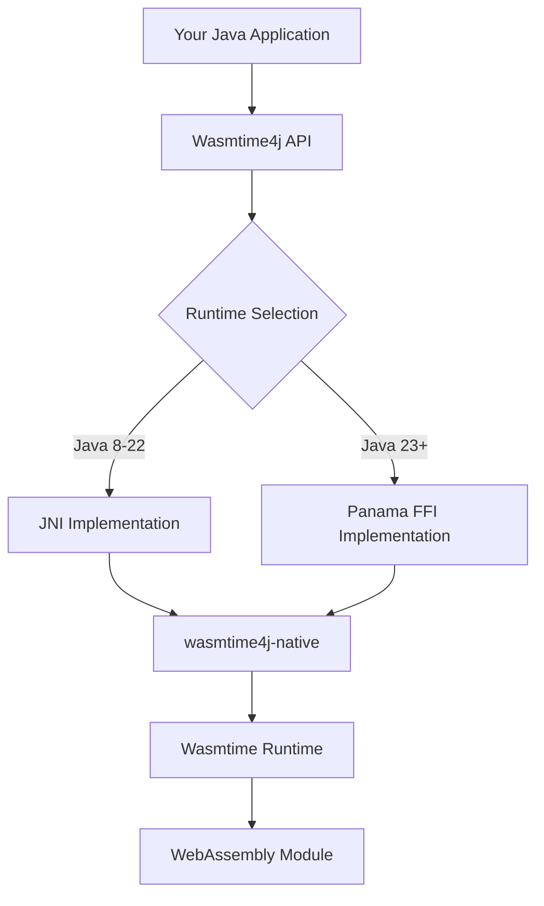

# Wasmtime4j

**High-performance Java bindings for the Wasmtime WebAssembly runtime**

Wasmtime4j provides unified, production-ready Java bindings for executing WebAssembly modules using the Wasmtime runtime. It offers both JNI and Panama Foreign Function API implementations with automatic runtime selection for optimal performance across Java versions.

## Key Features

- **🚀 High Performance**: Optimized bindings with minimal overhead
- **🔄 Dual Runtime Support**: JNI for Java 8-22, Panama FFI for Java 23+
- **🔒 Secure by Default**: Comprehensive sandboxing and security controls
- **🌐 WASI Support**: Full WebAssembly System Interface implementation
- **⚡ Auto-Selection**: Intelligent runtime selection based on Java version
- **🛠️ Production Ready**: Extensive testing, monitoring, and error handling
- **📱 Cross-Platform**: Support for Linux, macOS, and Windows (x86_64, ARM64)

## Quick Start

### Installation

Add Wasmtime4j to your Maven project:

```xml
<dependency>
    <groupId>ai.tegmentum</groupId>
    <artifactId>wasmtime4j</artifactId>
    <version>1.0.0-SNAPSHOT</version>
</dependency>
```

### Basic Usage

```java
import ai.tegmentum.wasmtime4j.*;
import ai.tegmentum.wasmtime4j.factory.WasmRuntimeFactory;

// Automatic runtime selection (JNI or Panama based on Java version)
try (WasmRuntime runtime = WasmRuntimeFactory.create()) {
    // Create optimized engine
    Engine engine = runtime.createEngine();
    
    // Compile WebAssembly module
    byte[] wasmBytes = Files.readAllBytes(Paths.get("module.wasm"));
    Module module = runtime.compileModule(engine, wasmBytes);
    
    // Create instance and execute function
    Instance instance = runtime.instantiate(module);
    WasmFunction addFunction = instance.getFunction("add");
    
    WasmValue[] results = addFunction.call(
        WasmValue.i32(5), 
        WasmValue.i32(3)
    );
    
    System.out.println("Result: " + results[0].asI32()); // Output: 8
}
```

## Architecture Overview



## Performance Characteristics

| Operation | JNI Performance | Panama Performance | 
|-----------|----------------|-------------------|
| Runtime Init | 100-1K ops/sec | 50-500 ops/sec |
| Function Calls | 1M-10M ops/sec | 800K-8M ops/sec |
| Memory Operations | 100K-1M ops/sec | 80K-800K ops/sec |
| Module Compilation | 1K-10K ops/sec | 1K-10K ops/sec |

*Performance varies by hardware and WebAssembly module complexity*

## Use Cases

### Enterprise Applications
- **Plugin Systems**: Safe execution of user-provided code
- **Data Processing**: High-performance data transformation pipelines  
- **Microservices**: WebAssembly-based microservice implementations
- **Edge Computing**: Lightweight, portable compute at the edge

### Development Scenarios
- **Multi-language Integration**: Execute code written in Rust, C++, Go via WASM
- **Sandbox Execution**: Run untrusted code safely with comprehensive isolation
- **Performance Optimization**: Replace JNI libraries with WebAssembly modules
- **Cross-Platform Libraries**: Use the same binary across different platforms

## Security Model

Wasmtime4j provides comprehensive security through multiple layers:

- **WebAssembly Sandboxing**: Memory isolation and control flow integrity
- **WASI Security Controls**: Fine-grained system access permissions
- **Resource Limits**: CPU, memory, and execution time constraints
- **Input Validation**: Comprehensive parameter and data validation
- **Host Function Security**: Secure bridging between WebAssembly and Java

## Getting Help

- **📖 Documentation**: Comprehensive guides and API reference
- **💬 Community Support**: GitHub Discussions and Issues
- **🐛 Bug Reports**: Detailed issue tracking and resolution
- **🤝 Contributing**: Open-source contribution guidelines

## Quick Links

<div class="row">
  <div class="span3">
    <div class="well">
      <h4><a href="getting-started.html">🚀 Getting Started</a></h4>
      <p>Install and run your first WebAssembly module in under 15 minutes.</p>
    </div>
  </div>
  <div class="span3">
    <div class="well">
      <h4><a href="apidocs/index.html">📚 API Documentation</a></h4>
      <p>Complete Javadoc reference for all public classes and methods.</p>
    </div>
  </div>
  <div class="span3">
    <div class="well">
      <h4><a href="examples.html">💡 Examples</a></h4>
      <p>Working code examples covering all major use cases and patterns.</p>
    </div>
  </div>
  <div class="span3">
    <div class="well">
      <h4><a href="performance.html">⚡ Performance</a></h4>
      <p>Optimization guides and benchmarking results for production use.</p>
    </div>
  </div>
</div>

<div class="row">
  <div class="span3">
    <div class="well">
      <h4><a href="security.html">🔒 Security</a></h4>
      <p>Security considerations and best practices for production deployment.</p>
    </div>
  </div>
  <div class="span3">
    <div class="well">
      <h4><a href="advanced-usage.html">🛠️ Advanced Usage</a></h4>
      <p>WASI integration, host functions, and complex integration patterns.</p>
    </div>
  </div>
  <div class="span3">
    <div class="well">
      <h4><a href="troubleshooting.html">🔧 Troubleshooting</a></h4>
      <p>Solutions for common issues and debugging techniques.</p>
    </div>
  </div>
  <div class="span3">
    <div class="well">
      <h4><a href="contributing.html">🤝 Contributing</a></h4>
      <p>Guidelines for contributing code, documentation, and issues.</p>
    </div>
  </div>
</div>

## Latest News

### Version 1.0.0-SNAPSHOT Released
*August 2024*

Initial snapshot release featuring:
- Complete JNI and Panama FFI implementations
- Full WASI support with security controls
- Comprehensive test suite with 90%+ coverage
- Production-ready performance optimizations
- Cross-platform support for all major architectures

[View full release notes](release-notes.html)

## Project Status

- **✅ Core API**: Complete and stable
- **✅ JNI Implementation**: Production ready
- **✅ Panama Implementation**: Production ready  
- **✅ WASI Support**: Full implementation
- **✅ Cross-platform**: Linux, macOS, Windows
- **✅ Documentation**: Comprehensive guides
- **✅ Testing**: 90%+ code coverage
- **🔄 Performance**: Ongoing optimization

## Community

Join our growing community of developers using WebAssembly in Java:

- **GitHub Repository**: [tegmentum/wasmtime4j](https://github.com/tegmentum/wasmtime4j)
- **Issue Tracker**: Report bugs and request features
- **Discussions**: Ask questions and share experiences
- **Contributing**: Help improve the project

---

**Ready to get started?** Check out our [Getting Started Guide](getting-started.html) or explore the [API Documentation](apidocs/index.html).